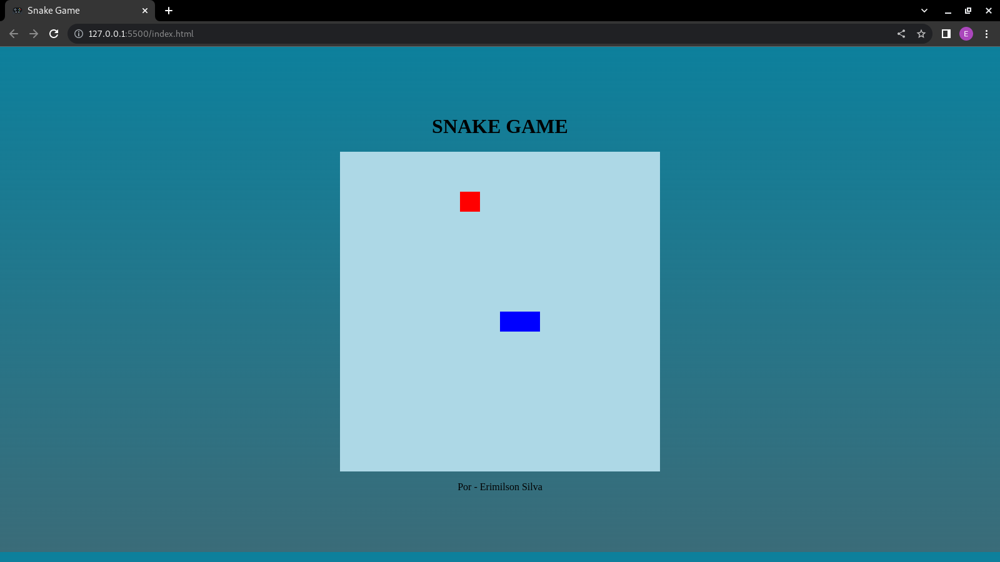

# Snake_game-JavaScript

### Projeto Final da Digital Innovation One - HTML Web Developer
#
### Recriando o jogo da Cobrinha com JavaScript
#
## Tela Inicial

#### Iniciando a criação do Gamer
    - 19/10/2021
    ---------------------------------------------------
    - Criando a Base dos arquivos html, javaScript
    -  Aula 1 Concluída
    ---------------------------------------------------
    - Criação de Movimentos 
    - Aula 2 Concluída
    ---------------------------------------------------
    - Controle dos Movimentos
    - Aula 3 Conluída 
    ---------------------------------------------------
    - Criando Ícone da Comida
    - Aula 4 Concluída
    ---------------------------------------------------
    - Pausa ás 15h
    - Retornado ás 19h50m
    ---------------------------------------------------
    - Ajuste da estrutura do gamer
    - Gamer concluído
    - Aula 5 Concluída
    ---------------------------------------------------
    - Estilizando a Página do nosso Gamer
    - Aula 6 Concluída
    - Finalizando aulas ás 20h25m
    - ************************************************ -

#### Adaptações aplicadas no Projeto
    - Alterações das cores no Layout do game
    - Ícone do titulo da página Adicionado
    - Adicionado Link do Projeto no GitHub : Por Erimilson Silva
    - Game Over! : Agora ao clicar em OK um novo jogo Começa.
    - Entregando Projeto dia 19/10/2021
    - Horário ás 22h
    - ************************************************************ -

#

&copy; Copyright 2022 Erimilson Silva

  

#